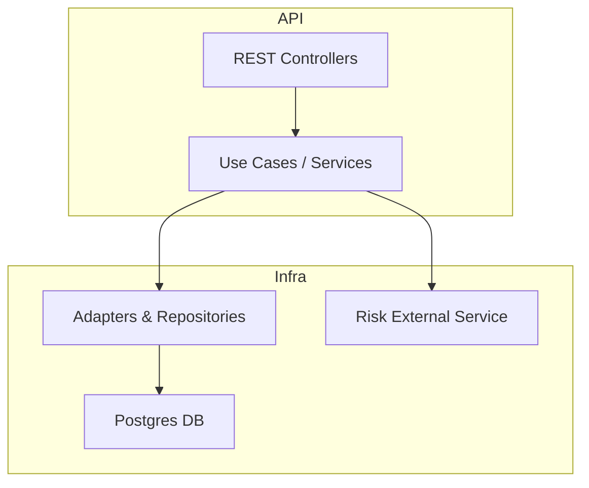

# CoopCredit - Credit Application Service

Professional Spring Boot microservice for managing credit applications, following Hexagonal Architecture, JWT security, Flyway migrations, and containerized deployment.

## Overview

CoopCredit implements a modular, secure service to register affiliates, submit credit applications and evaluate them using a deterministic external risk service (mock). The project emphasizes:

- Hexagonal architecture (domain, use cases, ports, adapters)
- JPA/Hibernate advanced usage with proper mappings and indexes
- Authentication: JWT (stateless) + BCrypt password encoding
- Flyway migrations for reliable DB versioning
- Observability via Spring Boot Actuator
- Containerization with Docker and docker-compose

Repository structure (high level)

```
/- src/
   /main/java/com/credits/coopCredit   -> main application code
       /application/usecases           -> use cases (business logic)
       /domain/model                   -> domain models (POJOs)
       /infrastructure                 -> adapters, entities, config, web
   /resources/db/migration            -> Flyway migrations V1..V4
/- risk-central-mock-service/         -> lightweight mock of external risk central (Spring Boot)
docker-compose.yml
pom.xml
```

## Architecture diagram

Simple component diagram:



## Quick prerequisites

- Java 17 (JDK)
- Maven 3.8+
- Docker & Docker Compose (for full-stack runs and Testcontainers tests)

## Environment variables

Copy `.env.example` to `.env` and edit values. Important variables:

- APP_NAME - container name
- SERVER_PORT - host port for the app
- DB_NAME, DB_USER, DB_PASSWORD, DB_PORT
- JWT_SECRET - secret used to sign JWTs (use a long random value)
- JWT_EXPIRATION - token TTL in milliseconds
- RISK_SERVICE_URL - URL of the risk microservice (default in compose: http://risk:8081)
- FLYWAY_* - flyway options

## Build and run locally (no Docker)

1. Build the app:

```bash
mvn -DskipTests package
```

2. Run the JAR:

```bash
java -jar target/CoopCredit-0.0.1-SNAPSHOT.jar
```

If you run locally, make sure `RISK_SERVICE_URL` points to the running risk mock (e.g. `http://localhost:8081`) or start the risk mock using the provided module.

## Run full-stack with Docker Compose (recommended)

This will bring up Postgres, the main application and the risk mock service.

1. Create `.env` from `.env.example` and set proper secrets.

```bash
cp .env.example .env
# edit .env and set JWT_SECRET, DB_PASSWORD, etc.
```

2. Start the stack:

```bash
docker-compose up --build
```

3. Access the API at `http://localhost:${SERVER_PORT}` (default 8080).

Notes:

- `RISK_SERVICE_URL` is injected to the app as `risk.service.url` property; when running via docker-compose the default value points to the `risk` service container at `http://risk:8081`.
- Flyway runs automatically if enabled via `FLYWAY_ENABLED=true`.

## Endpoints (summary)

- POST /api/v1/auth/register — register user (public)
- POST /api/v1/auth/login — authenticate and get JWT (public)
- POST /credit-applications — create a credit application (requires ROLE_AFILIADO)
- POST /risk-evaluation — risk mock (external service, used by the app)

OpenAPI/Swagger UI is enabled (see `/swagger-ui.html`).

## Security and Roles

Roles in the system:

- ROLE_AFILIADO — can create own credit applications
- ROLE_ANALISTA — can access pending applications for review
- ROLE_ADMIN — administrative operations

The project includes Flyway migration V4 that creates `roles` and `users` tables and seeds example users. Passwords in migrations are hashed with BCrypt. For quick testing, use `/auth/register` to create new users.

## Database migrations

Flyway migrations are in `src/main/resources/db/migration`:

- V1__schema.sql — base tables (affiliates, credit_applications, credit_evaluations)
- V2__relaciones.sql — constraints, indices and checks (created by the team)
- V3__datos_iniciales.sql — seed affiliates, evaluations and sample credit applications
- V4__user_security.sql — roles and users for security

If you need to re-run migrations, use a fresh database or clean the Flyway schema history table.

## Testing

Run unit and integration tests:

```bash
mvn test
```

Integration tests that use Testcontainers require Docker running.

## Observability

Actuator endpoints:

- `/actuator/health`
- `/actuator/info`
- `/actuator/metrics`

You can enable Prometheus metrics through Micrometer if required.

## Developer notes & common flows

Credit evaluation flow (summary):

1. Affiliate submits application (PENDING).
2. App calls `RISK_SERVICE_URL` `/risk-evaluation` with {documento, monto, plazo}.
3. Risk service returns {score, nivelRiesgo, detalle} (deterministic per documento).
4. App applies internal policies (quota/income, max by salary, seniority) and decides APROBADO/RECHAZADO.
5. Evaluation saved and application updated transactionally.

## Troubleshooting

- Flyway errors: verify DB credentials and `FLYWAY_*` env variables.
- JWT errors: check `JWT_SECRET` consistency and that your system clock is correct.
- Risk service unreachable: ensure `RISK_SERVICE_URL` is reachable (inside compose use `http://risk:8081`).

## Next steps / Useful additions

- Add a Postman collection for main flows (register, login, create application).
- Add small dev-only SQL to create users with clear passwords (never commit real secrets).
- Add more tests (security, edge-cases, policy boundaries).

---

If you want, I can now:

1. Add a Postman collection and link it here.
2. Run `docker-compose up --build` and perform a smoke test (register, login, create application) and report the results.
3. Seed dev users with readable passwords (dev-only migration) to simplify local testing.

Choose what you want me to do next.

# CoopCredit-App - Sistema de Solicitudes de Crédito 🏦

## 📋 Descripción

Sistema profesional de gestión de solicitudes de crédito para cooperativas, implementando **Arquitectura Hexagonal** (Puertos y Adaptadores) con principios **SOLID**, autenticación **JWT**, evaluación de riesgo automatizada, y control de acceso basado en roles.

## ✨ Características Principales

✅ **Arquitectura Hexagonal Completa** - Separación clara entre dominio, aplicación e infraestructura  
✅ **Autenticación JWT** - Seguridad stateless con tokens  
✅ **Control de Acceso por Roles** - AFILIADO, ANALISTA, ADMIN  
✅ **Evaluación de Riesgo Automatizada** - Integración con servicio externo  
✅ **Políticas de Crédito Internas** - Validación automática  
✅ **Principios SOLID** - Diseño orientado a objetos  
✅ **Validación con Bean Validation** - Anotaciones declarativas  
✅ **PostgreSQL + Flyway** - Migración de BD versionada  
✅ **MapStruct** - Mapeo automático de DTOs  
✅ **Swagger/OpenAPI** - Documentación interactiva  
✅ **Docker Ready** - Contenedorización lista  

## 🚀 Quick Start

### Requisitos

- Java 17+
- Maven 3.8+
- PostgreSQL 12+ (local o Docker)
- Docker & Docker Compose (opcional)

### Ejecución Rápida

```bash
# 1. Compilar
mvn clean package -DskipTests

# 2. Ejecutar
java -jar target/CoopCredit-0.0.1-SNAPSHOT.jar

# 3. Acceder a Swagger
# http://localhost:8080/swagger-ui/index.html
```

### Con Docker Compose

```bash
docker-compose up --build
```

## 📐 Arquitectura Hexagonal

```
┌──────────────────────────────────────────────────┐
│              INFRASTRUCTURE                      │
│  REST Controllers │ JPA │ External Services     │
└─────────┬────────────────────┬──────────────────┘
          │                    │
   ┌──────▼──────┐      ┌──────▼──────┐
   │  IN Ports   │      │  OUT Ports  │
   │ (UseCases)  │      │ (Repository)│
   └──────┬──────┘      └──────┬──────┘
          │                    │
┌─────────▼────────────────────▼──────────────────┐
│          APPLICATION LAYER           │
│  Use Case Implementations            │
└──────────────┬───────────────────────────────────┘
               │
┌──────────────▼───────────────────────────────────┐
│           DOMAIN LAYER                           │
│  Pure Business Models - No Dependencies          │
└──────────────────────────────────────────────────┘
```

### Estructura de Directorios

```
src/main/java/com/credits/coopCredit/
├── domain/
│   ├── model/         # POJOs puros (Affiliate, CreditApplication, CreditEvaluation)
│   └── ports/
│       ├── in/        # Casos de uso (interfaces)
│       └── out/       # Puertos de salida (Repository, RiskCentral)
├── application/
│   └── usecases/      # Implementaciones de casos de uso
│       ├── affiliate/ # CreateAffiliate, UpdateAffiliate, GetAffiliate
│       ├── credit/    # CreateCredit, EvaluateCredit, GetCreditApplication
│       └── auth/      # Login, Register
└── infrastructure/
    ├── adapters/
    │   └── out/       # RiskCentralAdapter, RepositoryAdapters
    ├── config/        # Spring Config, Security
    ├── entities/      # JPA Entities
    ├── repositories/  # Spring Data JPA
    └── web/
        ├── controller/# REST Controllers
        ├── dto/       # Request/Response DTOs
        └── mapper/    # MapStruct Mappers
```

## 🔐 Seguridad y Roles

### Autenticación

```bash
# Registro
curl -X POST http://localhost:8080/api/v1/auth/register \
  -H "Content-Type: application/json" \
  -d '{
    "username": "analista1",
    "password": "Pass123!",
    "email": "analista@coopcredit.com",
    "role": "ROLE_ANALISTA"
  }'

# Login
curl -X POST http://localhost:8080/api/v1/auth/login \
  -H "Content-Type: application/json" \
  -d '{
    "username": "analista1",
    "password": "Pass123!"
  }'
```

### Permisos por Rol

| Endpoint | AFILIADO | ANALISTA | ADMIN |
|----------|----------|----------|-------|
| POST /affiliates | ❌ | ❌ | ✅ |
| GET /affiliates/{id} | ❌ | ✅ | ✅ |
| POST /credit-applications | ✅ (propias) | ❌ | ✅ |
| POST /credit-applications/{id}/evaluate | ❌ | ✅ | ✅ |

## 📊 API Endpoints

### Afiliados

- `POST /api/v1/affiliates` - Crear afiliado (ADMIN)
- `PUT /api/v1/affiliates/{id}` - Actualizar afiliado (ADMIN)
- `GET /api/v1/affiliates/{id}` - Obtener por ID (ANALISTA, ADMIN)
- `GET /api/v1/affiliates/documento/{documento}` - Obtener por documento

### Solicitudes de Crédito

- `POST /api/v1/credit-applications` - Crear solicitud (AFILIADO, ADMIN)
- `GET /api/v1/credit-applications/{id}` - Obtener solicitud
- `GET /api/v1/credit-applications` - Listar con filtros
  - `?estado=PENDIENTE`
  - `?affiliateId=1`
- `POST /api/v1/credit-applications/{id}/evaluate` - Evaluar (ANALISTA, ADMIN)

## 🔄 Flujo de Evaluación de Crédito

1. **Creación de Solicitud**: Afiliado ACTIVO crea solicitud → `PENDIENTE`
2. **Llamada Externa**: Sistema consulta `risk-central-mock-service`
3. **Validación de Políticas**:
   - ✅ Cuota mensual ≤ 40% salario
   - ✅ Monto ≤ 20 × salario
   - ✅ Score ≥ 501
   - ✅ Antigüedad ≥ 6 meses
4. **Decisión Automática**: `APROBADO` o `RECHAZADO`
5. **Persistencia**: Evaluación guardada y estado actualizado

## ⚙️ Configuración

### Variables de Entorno

| Variable | Descripción | Valor por Defecto |
|----------|-------------|-------------------|
| `SERVER_PORT` | Puerto del servidor | `8080` |
| `DB_NAME` | Nombre de BD | `coopcredit_db` |
| `DB_USER` | Usuario PostgreSQL | `postgres` |
| `DB_PASSWORD` | Contraseña PostgreSQL | `postgres` |
| `JWT_SECRET` | Secreto JWT (256 bits) | - |
| `JWT_EXPIRATION` | Expiración token (ms) | `3600000` |
| `RISK_SERVICE_URL` | URL servicio riesgo | `http://localhost:8081` |

### application.properties

```properties
server.port=${SERVER_PORT:8080}
spring.datasource.url=${SPRING_DATABASE}:${DB_PORT}/${DB_NAME}
jwt.secret=${JWT_SECRET}
risk.service.url=${RISK_SERVICE_URL:http://localhost:8081}
```

## 🛠️ Stack Tecnológico

- **Framework**: Spring Boot 3.3.4
- **Seguridad**: Spring Security 6 + JWT
- **Base de Datos**: PostgreSQL 15 + Flyway
- **ORM**: JPA/Hibernate
- **Mapeo**: MapStruct 1.5.5
- **Validación**: Bean Validation
- **Utilidades**: Lombok
- **Documentación**: Swagger/OpenAPI 2.5.0
- **Build**: Maven 3.11.0
- **Contenedores**: Docker + Docker Compose

## 📝 Ejemplos de Uso

### 1. Crear Afiliado

```bash
curl -X POST http://localhost:8080/api/v1/affiliates \
  -H "Authorization: Bearer YOUR_ADMIN_TOKEN" \
  -H "Content-Type: application/json" \
  -d '{
    "documento": "1234567890",
    "nombre": "Juan Pérez",
    "salario": 5000000,
    "fechaAfiliacion": "2024-01-15"
  }'
```

### 2. Crear Solicitud de Crédito

```bash
curl -X POST http://localhost:8080/api/v1/credit-applications \
  -H "Authorization: Bearer YOUR_AFILIADO_TOKEN" \
  -H "Content-Type: application/json" \
  -d '{
    "documento": "1234567890",
    "monto": 10000000,
    "plazo": 36,
    "tasa": 1.5
  }'
```

### 3. Evaluar Solicitud

```bash
curl -X POST http://localhost:8080/api/v1/credit-applications/1/evaluate \
  -H "Authorization: Bearer YOUR_ANALISTA_TOKEN"
```

## 🐳 Docker

```bash
# Construir imagen
docker build -t coopcredit-app:latest .

# Docker Compose
docker-compose up -d
docker-compose logs -f app
docker-compose down
```

## 📚 Documentación

- **Swagger UI**: http://localhost:8080/swagger-ui/index.html
- **OpenAPI JSON**: http://localhost:8080/v3/api-docs
